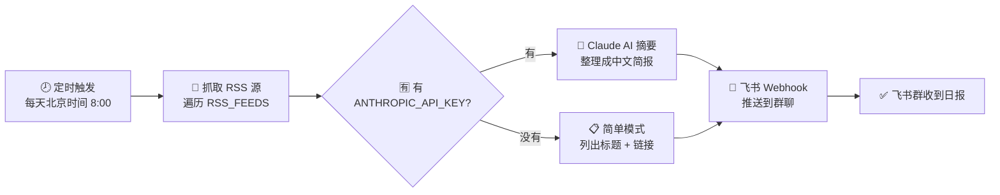

# 每日 AI 资讯 → 飞书推送

每天定时抓取 AI 新闻，整理成简报，自动发到你的飞书群聊。完全跑在 GitHub 的免费云服务器上，不需要你自己开电脑。

## 文件说明

| 文件 | 说明 |
|------|------|
| `fetch_ai_news.py` | 主脚本：抓 RSS →（可选）AI 摘要 → 发飞书 |
| `requirements.txt` | Python 依赖 |
| `.github/workflows/daily-ai-news.yml` | 定时任务配置，默认每天北京时间 8 点跑一次 |

---

## 流程图



---

## 第一步：添加飞书自定义机器人

1. 打开飞书，进入你想接收推送的群聊
2. 点击群设置 → **群机器人** → **添加机器人** → **自定义机器人**
3. 给机器人起个名字（比如 **AI 日报助手**）
4. 飞书会生成一个 webhook URL，形如：

   ```
   https://open.feishu.cn/open-apis/bot/v2/hook/xxxxxxxxxxxxxxxxxxxx
   ```

5. 记下这个 URL，这就是 `FEISHU_WEBHOOK_URL`

> **安全提示（可选）**：创建机器人时可以设置**签名校验**，你会得到一个签名密钥。如果设置了，记得把 `FEISHU_SECRET` 也填入 Secrets。不设也行，用起来更简单。

## 第二步：新建 GitHub 仓库并上传文件

1. 去 GitHub 新建一个仓库（建议设为 **Private**，毕竟要存 webhook URL）
2. 把整个项目文件（包括 `.github` 文件夹）上传上去，保持目录结构不变

## 第三步：配置 Secrets

进入仓库 **Settings → Secrets and variables → Actions → New repository secret**，依次添加：

| Name | Value |
|------|-------|
| `FEISHU_WEBHOOK_URL` | 第一步拿到的 webhook URL |
| `FEISHU_SECRET` | （可选）机器人签名校验的密钥，没设置就不填 |
| `ANTHROPIC_API_KEY` | （可选）你的 Claude API key，不填则跳过 AI 摘要，只发标题和链接 |

## 第四步：测试一下

1. 进入仓库的 **Actions** 标签页
2. 左侧点 **Daily AI News Digest**
3. 右边点 **Run workflow** 手动触发一次
4. 等一两分钟，看看飞书群有没有收到消息；如果没收到，点进这次运行记录看报错日志

之后就是**全自动的**了——默认每天北京时间早上 8 点自动运行一次，不需要再管。

---

## 想自定义？

- **改 RSS 源**：编辑 `fetch_ai_news.py` 里的 `RSS_FEEDS` 列表，自己加你喜欢的信息源
- **改推送时间**：编辑 `.github/workflows/daily-ai-news.yml` 里的 `cron` 表达式（注意是 **UTC 时间**，北京时间减 8 小时）
- **改成推送到 Telegram / 企业微信**：把 `fetch_ai_news.py` 里的 `send_feishu_message` 换成对应接口就行

## 已知限制 / 排查提示

- RSS 地址有时会失效或改版，第一次运行如果发现抓到 0 条，去对应网站确认一下新的 RSS 链接
- 没填 `ANTHROPIC_API_KEY` 时只是简单列出原始条目，质量会比 AI 摘要差一些，但完全可用
- 飞书机器人**免费额度足够用**，自定义机器人每分钟最多 20 条，完全够日报场景
- 自定义机器人只能推送到群聊，不能私聊；如果需要私聊推送，需要用飞书应用方式
